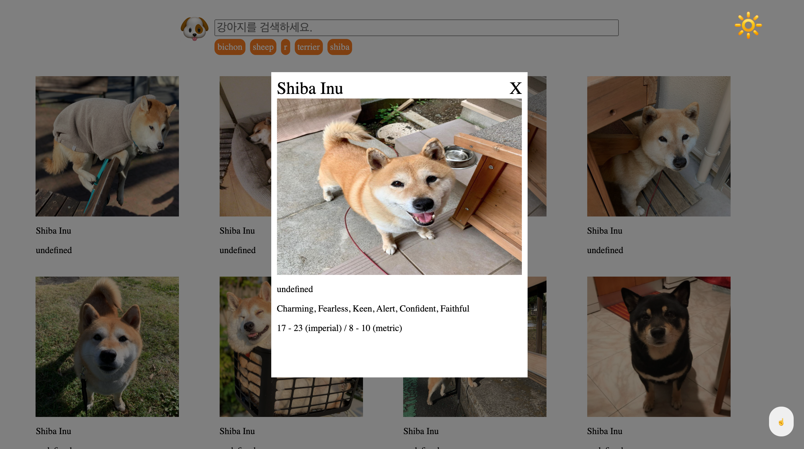

# ilovedog
> 프로그래머스 2020 Dev-Matching 프론트엔드 과제 

학습: https://github.com/woohyeonjo/ilovecat-javascript

### 개발환경
- babel, eslint, web server 
- vanilla javascript 

### Goals
- 시맨틱 웹, 반응형 페이지
- 로딩 화면과 결과 없음 페이지
- Modal 만들기 
- 이벤트 리스너 줄이기 
- 필요한 시점에 필요한 리소스 가져오기 
- 새로고침 후에도 결과 화면 유지하기 
- 무한 스크롤 만들기 
- 비동기 요청 에러 핸들링하기

### Update
- 다크 모드(Refactoring)
